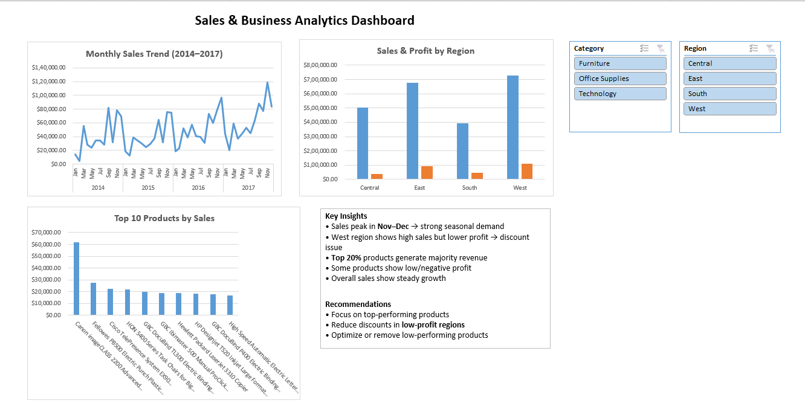
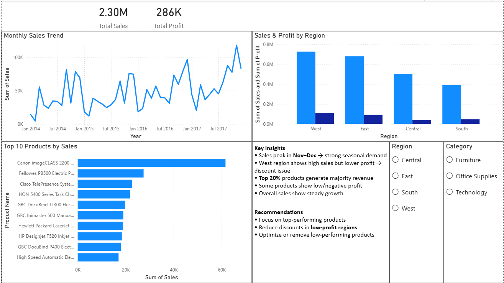

# 📊 Sales & Business Analytics Dashboard

## 📌 Project Overview

This project analyzes retail sales data to uncover business insights related to sales trends, regional performance, and product-level analysis. Interactive dashboards were built using Excel and Power BI.

---

## 🛠 Tools Used

* Microsoft Excel (Pivot Tables, Charts, Dashboard)
* Power BI (Interactive Dashboard, Slicers, KPI Cards)

---

## 📷 Dashboard Preview

## 📊 Key Features

* Monthly Sales Trend Analysis
* Region-wise Sales & Profit Comparison
* Top 10 Products by Sales
* Interactive Filters (Region & Category)
* KPI Cards (Total Sales & Profit)

---

## 📈 Key Insights

* Sales peak during November–December indicating strong seasonal demand
* Top 20% of products contribute to majority of revenue
* West region shows high sales but relatively lower profit
* Some products have low or negative profit margins
* Overall business shows steady growth

---

## 💡 Recommendations

* Focus marketing efforts on top-performing products
* Reduce discounts in low-profit regions
* Optimize or remove low-performing products
* Prepare inventory for peak seasons

---

## 📂 Files Included

* Excel Dashboard (.xlsx)
* Power BI Dashboard (.pbix)

---

## 🚀 Conclusion

This project demonstrates data cleaning, analysis, and dashboarding skills using Excel and Power BI, along with business insights and decision-making recommendations.
